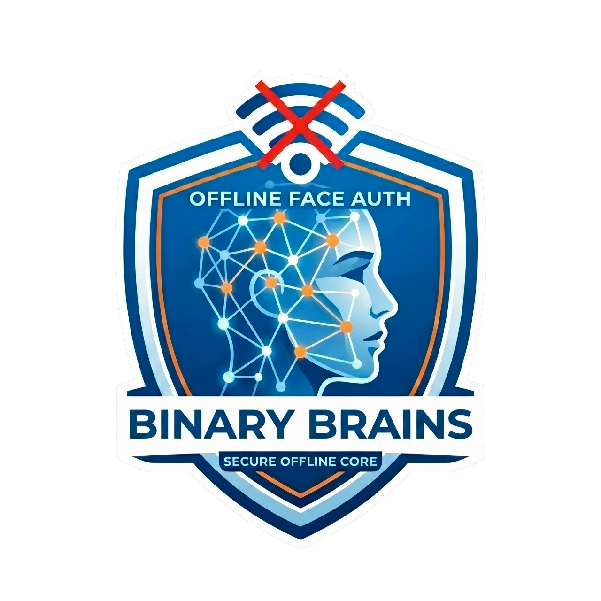
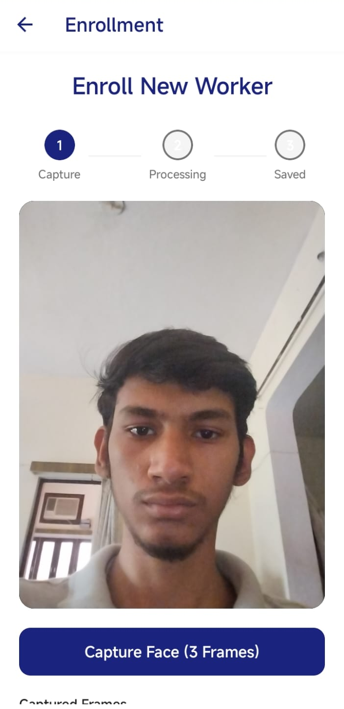
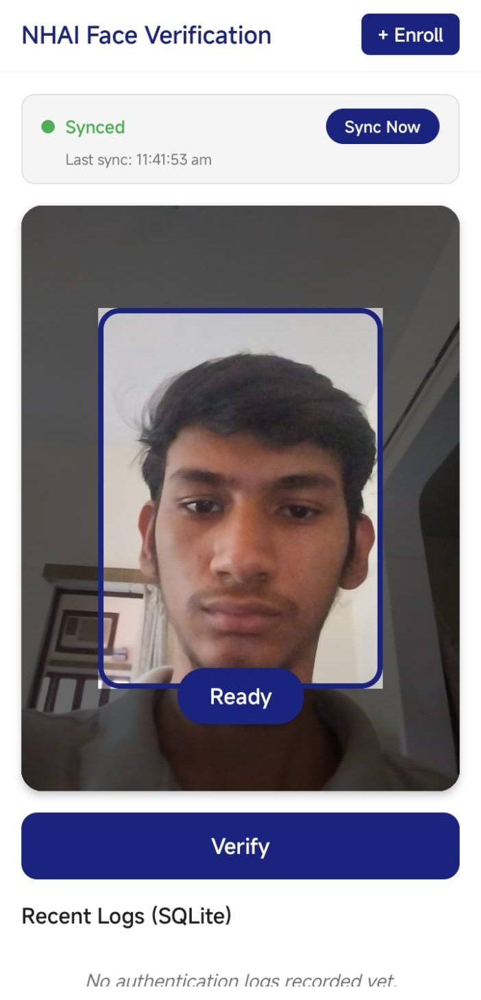
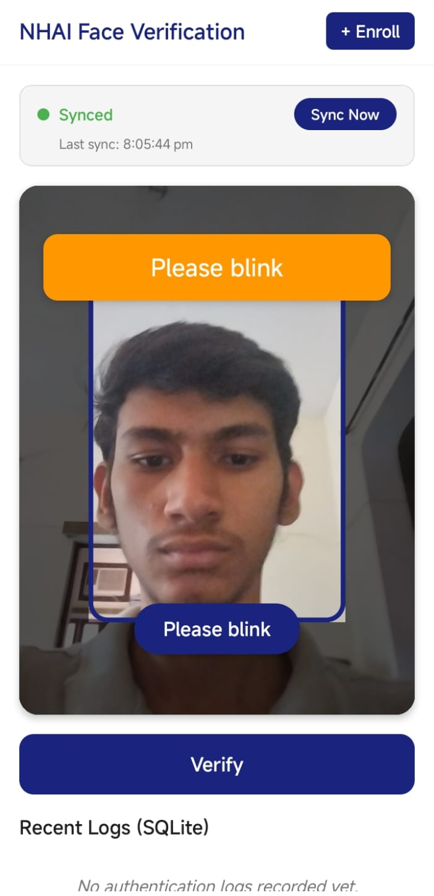
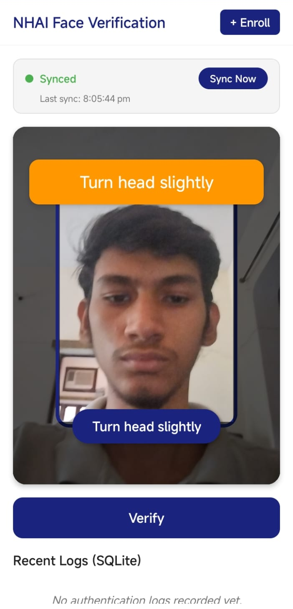
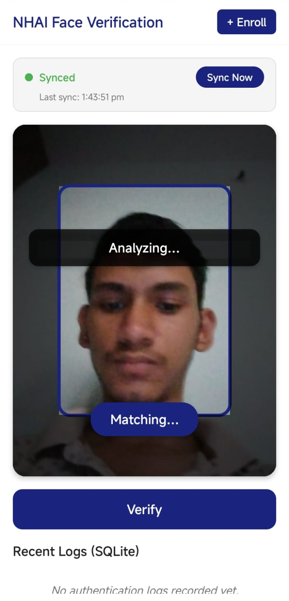
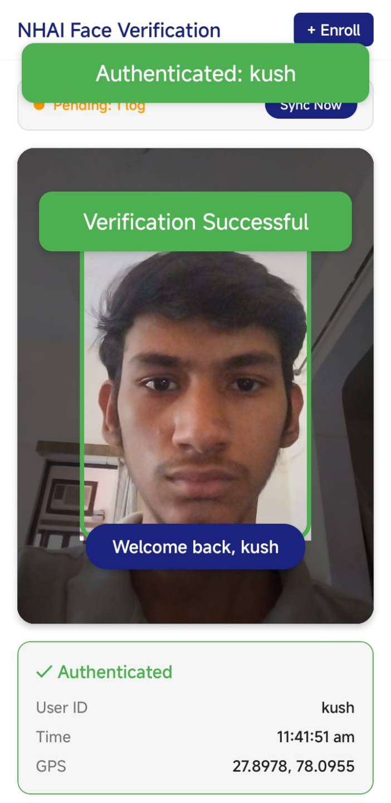
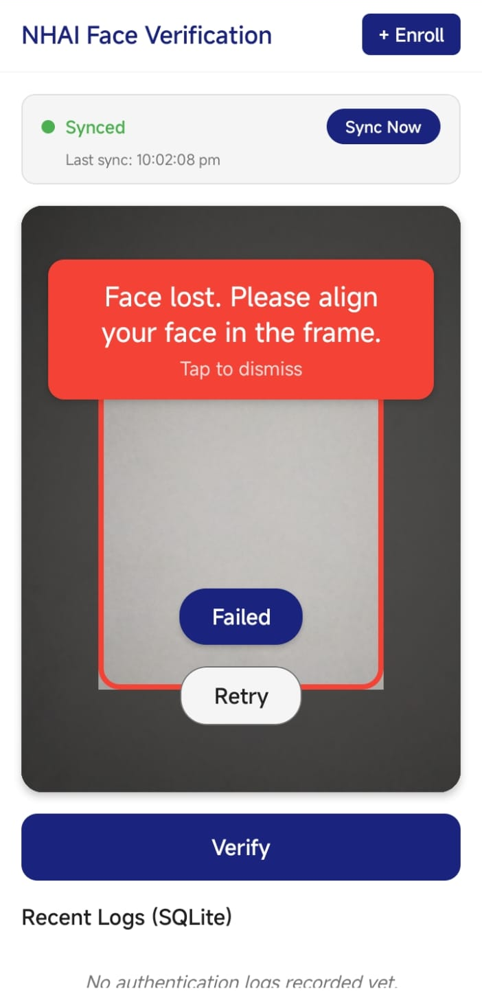
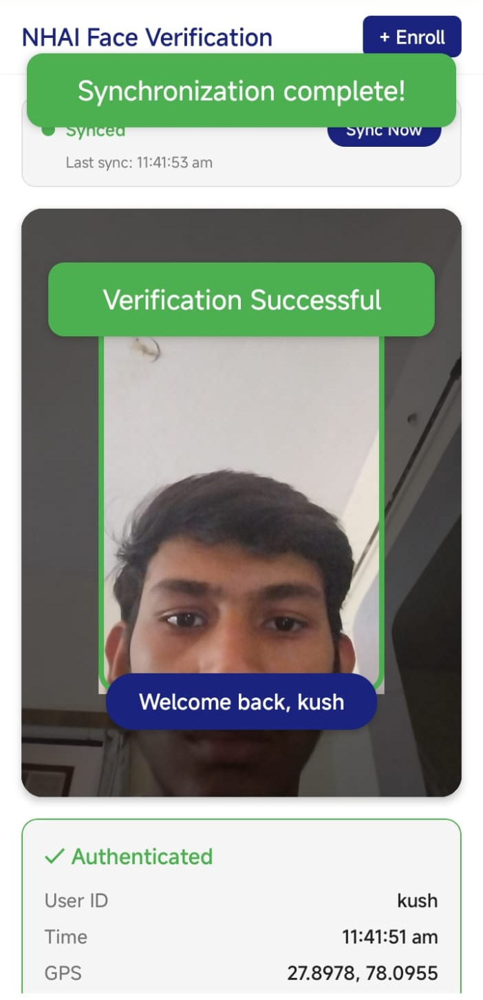

<p align="center">
  
</p>

<h1 align="center">🔐 EdgeLock</h1>
<h3 align="center">Enterprise-Grade Offline-First Face Authentication & 3D Liveness Detection</h3>

<p align="center">
  
  
  
  
  
  
</p>

<p align="center">
  <strong>Built by Team Binary Brains for NHAI Hackathon 7.0</strong><br/>
  An enterprise-ready, offline-first facial authentication and secure logging solution engineered specifically for <strong>NHAI (National Highways Authority of India)</strong> field operations. Designed to function reliably in remote highway environments with <strong>zero network connectivity</strong>.
</p>

<p align="center">
  This repository features a unified React Native codebase targetable to both <strong>Android</strong> and <strong>iOS</strong> platforms, optimized for cloud-based compilation via <strong>Expo Application Services (EAS)</strong>, allowing development and build delivery from Windows/Linux hosts.
</p>

---

## 📑 Table of Contents

- [App Demo & Screenshots](#-app-demo--screenshots)
- [Architecture Pipeline](#-architecture-pipeline)
- [Technical Stack](#-technical-stack)
- [Project Structure](#-project-structure)
- [Key Features & Implementations](#-key-features--implementations)
- [Screens & Navigation](#-screens--navigation)
- [Database Schemas](#-database-schemas)
- [Configuration Constants](#-configuration-constants)
- [Environment Variables](#-environment-variables)
- [Setup & Installation](#-setup--installation)
- [Running Verification & Tests](#-running-verification--tests)
- [iOS Development & Testing](#-ios-development--testing-from-windowslinux)
- [Android Development & Testing](#-android-development--testing)
- [App Startup Sequence](#-app-startup-sequence)
- [AWS Sync Protocol](#-aws-sync-protocol)
- [Core Engineering Decisions](#-core-engineering-decisions)
- [Available Scripts](#-available-scripts)
- [Contributing](#-contributing)
- [Team](#-team)
- [License](#-license)

---

## 📱 App Demo & Screenshots

> **📸** Screenshots below. Image size: **360×780px** for phone screenshots or **1280×720px** for landscape/feature screenshots.

### App Screens

<p align="center">
  
  &nbsp;&nbsp;&nbsp;
  
  &nbsp;&nbsp;&nbsp;
  
  &nbsp;&nbsp;&nbsp;
  
</p>
<p align="center">
  <em>Splash Screen → Home / Demo Auth → Face Enrollment → Authentication</em>
</p>

### Liveness Detection in Action

<p align="center">
  
  &nbsp;&nbsp;&nbsp;
  
  &nbsp;&nbsp;&nbsp;
  
</p>
<p align="center">
  <em>Blink Challenge → Head Turn Challenge → Liveness Passed</em>
</p>

### Authentication Results

<p align="center">
  
  &nbsp;&nbsp;&nbsp;
  
  &nbsp;&nbsp;&nbsp;
  
</p>
<p align="center">
  <em>Auth Success → Auth Failed → Cloud Sync Status</em>
</p>

### Feature Highlights

| Feature | Description |
|---------|-------------|
| 🔒 **Offline-First** | Works with zero network connectivity in remote highway areas |
| 🧠 **3D Liveness Detection** | Multi-factor anti-spoofing: blink, head turn, 3D depth analysis |
| 🎯 **GhostFaceNet INT8** | On-device neural inference (~1 MB model, 512-dim embeddings) |
| 🔐 **AES-256 Encryption** | Hardware-backed encrypted storage for biometric data |
| 📡 **Zero-Loss Sync** | Guaranteed log delivery with transactional cloud sync |
| 📍 **Geo-Tagged Logs** | GPS coordinates attached to every authentication event |
| ⚡ **CLAHE Preprocessing** | Adaptive lighting normalization for outdoor highway conditions |
| 📐 **5-Point Face Alignment** | Similarity transform to canonical 112×112 pose before inference |

> **💡 Tip:** To add a demo video/GIF, place it in `demo/` and embed it like:
> ```markdown
> <p align="center">
>   
> </p>
> ```

---

## 🏗️ Architecture Pipeline

```
Camera Feed ➔ MediaPipe Face Mesh (Liveness WebView) ➔ JPEG Decode (jpeg-js) ➔ Face Alignment (CLAHE) ➔ GhostFaceNet INT8 Embedding ➔ Cosine Similarity Matching (SQLite) ➔ Encrypted Local Logging ➔ AWS Sync Queue
```

### Detailed Authentication Flow

```
┌─────────────────────────────────────────────────────────────────────────────┐
│  1. SCANNING      │ Camera captures low-res JPEG every ~100ms               │
│  2. LIVENESS      │ MediaPipe WebView extracts 468 face landmarks           │
│                   │ ├── Passive 3D depth check (z-coord std dev)            │
│                   │ ├── Active challenge: BLINK (EAR < 0.33)                │
│                   │ └── Active challenge: HEAD_TURN (yaw > 0.12)            │
│  3. MATCHING      │ 3-shot averaged embedding via GhostFaceNet INT8         │
│                   │ ├── Cosine similarity against encrypted DB              │
│                   │ ├── Multi-user: margin ≥ 0.05, ratio ≥ 1.08             │
│                   │ └── Single-user: threshold ≥ 0.75 (borderline retry)    │
│  4. AUTHENTICATED │ Auth log stored in SQLite, background AWS sync          │
│     or FAILED     │ Haptic feedback, retry available                        │
└─────────────────────────────────────────────────────────────────────────────┘
```

### High-Level System Architecture

```
┌─────────────────────────────────────────────────────────────────────┐
│                        EdgeLock Mobile App                          │
│                                                                     │
│  ┌──────────┐  ┌──────────────┐  ┌────────────────┐                 │
│  │  Camera   │→│  MediaPipe   │→│  GhostFaceNet  │                  │
│  │  Module   │  │  WebView     │  │  TFLite INT8   │                │
│  │ (640×480) │  │  (468 pts)   │  │  (112×112 in)  │                │
│  └──────────┘  └──────────────┘  └───────┬────────┘                 │
│                                          │                          │
│                                   512-dim embedding                 │
│                                          │                          │
│  ┌──────────────────────────────────────┐│                          │
│  │         Encrypted SQLite DB          ││                          │
│  │  ┌──────────────┐ ┌──────────────┐   │▼                          │
│  │  │enrolled_faces│ │  auth_logs   │←── Cosine Similarity Match    │
│  │  │ (AES-256 CBC)│ │ (GPS tagged) │  │                            │
│  │  └──────────────┘ └──────┬───────┘  │                            │
│  └──────────────────────────┼──────────┘                            │
│                              │                                      │
│                    ┌─────────▼─────────┐                            │
│                    │  AWS Sync Queue   │                            │
│                    │ (Zero-Loss Purge) │                            │
│                    └─────────┬─────────┘                            │
└──────────────────────────────┼──────────────────────────────────────┘
                               │
                    ┌──────────▼──────────┐
                    │   AWS Cloud / Mock  │
                    │   Sync Endpoint     │
                    └─────────────────────┘
```

---

## 🛠️ Technical Stack

| Category | Technology | Details |
|----------|-----------|---------|
| **Core Framework** | Expo SDK 50 + React Native 0.73.6 | Unified cross-platform codebase |
| **Language** | TypeScript (Strict Mode) | Full type safety across the entire codebase |
| **Local Database** | `expo-sqlite` | Relational SQL engine utilizing system SQLite |
| **Security** | `react-native-encrypted-storage` + AES-256 | Hardware-backed iOS Keychain / Android Keystore |
| **Neural Inference** | `react-native-fast-tflite` (JSI/C++) | Synchronous model execution via JSI bridge |
| **On-Device Model** | GhostFaceNet INT8 (~1 MB) | 512-dimensional unit L2-normalized embeddings |
| **Liveness Engine** | MediaPipe Face Mesh (WASM) | 468 3D face landmarks via WebView |
| **Image Processing** | `jpeg-js` + CLAHE | Pure JS decoder + adaptive histogram equalization |
| **Navigation** | React Navigation (Stack) | Stack-based screen transitions |
| **Camera** | `expo-camera` | Front-facing, 640×480 capture |
| **Location** | `expo-location` | Balanced accuracy GPS for geo-tagging |
| **Haptics** | `expo-haptics` | Cross-platform tactile feedback |
| **Network** | `@react-native-community/netinfo` | Real-time online/offline detection |
| **Mock Server** | Express 4 | Local dev sync endpoint |

<details>
<summary><strong>📦 Full Dependencies Table</strong></summary>

| Package | Version | Purpose |
|---|---|---|
| `expo` | ~50.0.14 | Core Expo SDK |
| `react` / `react-native` | 18.2.0 / 0.73.6 | UI runtime |
| `expo-camera` | ~14.1.3 | Front camera capture |
| `expo-sqlite` | ~13.4.0 | On-device relational DB |
| `expo-file-system` | ~16.0.9 | Local file I/O for MediaPipe asset caching |
| `expo-constants` | ~15.4.6 | Stable device ID generation |
| `expo-location` | ~16.5.5 | GPS coordinates for auth logs |
| `expo-haptics` | ~12.8.1 | Tactile feedback on auth events |
| `expo-image-manipulator` | ~11.8.0 | Image manipulation utilities |
| `react-native-fast-tflite` | ^1.1.0 | JSI-based TFLite inference (C++ bridge) |
| `react-native-webview` | 13.6.4 | MediaPipe Face Mesh WASM runtime |
| `react-native-encrypted-storage` | ^4.0.3 | Hardware-backed secure key storage |
| `@react-native-community/netinfo` | 11.1.0 | Network state monitoring |
| `@react-native-async-storage/async-storage` | 1.21.0 | Last sync timestamp persistence |
| `@react-navigation/native` | ^6.1.9 | Navigation container |
| `@react-navigation/stack` | ^6.3.20 | Stack-based screen navigation |
| `react-native-gesture-handler` | ~2.14.0 | Gesture support for navigation |
| `react-native-safe-area-context` | 4.8.2 | Safe area insets |
| `react-native-screens` | ~3.29.0 | Native screen containers |
| `crypto-js` | ^4.2.0 | AES-256 encryption/decryption |
| `jpeg-js` | ^0.4.4 | Pure JS JPEG decoder (no native deps) |
| `base-64` | ^1.0.0 | Base64 encode/decode for React Native |
| `uuid` | ^9.0.1 | UUID generation for log entries |

</details>

<details>
<summary><strong>🔧 Dev Dependencies Table</strong></summary>

| Package | Version | Purpose |
|---|---|---|
| `typescript` | ^5.3.0 | TypeScript compiler |
| `jest` | ^29.2.1 | Test runner |
| `@testing-library/react-native` | ^12.4.3 | Component testing utilities |
| `react-test-renderer` | ^18.2.0 | React component rendering for tests |
| `@babel/core` | ^7.20.0 | Babel transpilation |
| `babel-preset-expo` | ~10.0.1 | Expo-specific Babel preset |
| `@types/react` | ~18.2.45 | React type definitions |
| `@types/react-native` | ~0.73.0 | React Native type definitions |
| `@types/crypto-js` | ^4.2.2 | CryptoJS type definitions |
| `@types/base-64` | ^1.0.2 | Base-64 type definitions |

</details>

---

## 📁 Project Structure

```
NHAI-Hackathon-7.0/
├── App.tsx                        # Root entry (re-exports src/App.tsx)
├── src/
│   ├── App.tsx                    # Main app: DB/model/MediaPipe init, navigation, hidden WebView
│   ├── components/
│   │   ├── FaceAuthenticator.tsx   # Full auth orchestration UI component
│   │   ├── CameraOverlay.tsx       # Camera feed with animated face-cutout overlay
│   │   └── LivenessFeedback.tsx    # Success/error/warning banner component
│   ├── screens/
│   │   ├── DemoAuthScreen.tsx      # Main demo screen (auth + enrollment + sync UI)
│   │   └── EnrollmentScreen.tsx    # Multi-capture face enrollment workflow
│   ├── services/
│   │   ├── ai/
│   │   │   ├── recognition.ts      # GhostFaceNet INT8 model: init, extract, match, average
│   │   │   ├── liveness.ts         # LivenessEngine state machine (EAR, yaw, depth)
│   │   │   ├── mediapipeLandmarks.ts  # WebView bridge: asset caching, JS injection, HTML template
│   │   │   └── faceAlignment.ts    # 5-point similarity transform face warp (112×112)
│   │   ├── camera/
│   │   │   └── frameProcessors.ts  # Frame capture, CLAHE pipeline, enrollment helpers
│   │   ├── database/
│   │   │   ├── sqlite.ts           # DB open, executeSql wrapper, schema init
│   │   │   ├── enrolledFaces.ts    # Insert/get/delete enrolled faces (AES encrypted)
│   │   │   └── authLogs.ts         # Insert/query/delete auth log records
│   │   ├── encryption/
│   │   │   └── secureStorage.ts    # Hardware-backed AES-256 key management
│   │   ├── location/
│   │   │   └── geolocation.ts      # GPS coordinate retrieval (balanced accuracy)
│   │   └── network/
│   │       ├── awsSync.ts          # Batch sync engine with zero-loss purge rules
│   │       └── connectionInfo.ts   # useNetInfo hook wrapper
│   ├── hooks/
│   │   ├── useAuth.ts              # Core auth pipeline orchestrator (592 lines)
│   │   └── useNetworkStatus.ts     # Auto-sync on network reconnection
│   ├── utils/
│   │   ├── imagePreProc.ts         # CLAHE, histogram EQ, JPEG decode, quality gates, fast preprocess
│   │   ├── recognitionPreprocess.ts # Capture + quality gate + variance gate pipeline
│   │   ├── math.ts                 # Cosine similarity & L2 normalization
│   │   └── cryptoPolyfill.ts       # global.crypto.getRandomValues polyfill for Hermes/JSC
│   ├── constants/
│   │   ├── config.ts               # Thresholds, URLs, model paths, feature flags
│   │   └── liveness.ts             # Challenge enum, EAR/MAR/yaw landmark indices & thresholds
│   └── types/
│       └── index.ts                # AuthLog, LivenessError, FaceAuthenticatorProps
├── assets/
│   ├── icon.png                    # App icon (1149 KB)
│   ├── adaptive-icon.png           # Android adaptive icon (1149 KB)
│   ├── splash.png                  # Splash screen (398 KB)
│   ├── models/
│   │   └── ghostfacenet_fixed_int8.tflite  # GhostFaceNet INT8 quantized (~1 MB)
│   └── mediapipe/
│       ├── face_mesh.binarypb                               # Graph definition (939 bytes)
│       ├── face_mesh_js.bin                                 # Face Mesh JS (65 KB)
│       ├── face_mesh_solution_packed_assets.data             # Packed model data (3.8 MB)
│       ├── face_mesh_solution_packed_assets_loader_js.bin    # Asset loader JS (9 KB)
│       ├── face_mesh_solution_simd_wasm_bin.wasm             # SIMD WASM binary (5.9 MB)
│       ├── face_mesh_solution_simd_wasm_bin_js.bin           # SIMD JS glue (330 KB)
│       ├── face_mesh_solution_wasm_bin.wasm                  # Non-SIMD WASM fallback (5.8 MB)
│       └── face_mesh_solution_wasm_bin_js.bin                # Non-SIMD JS glue (330 KB)
├── demo/                           # 📸 App demo screenshots & recordings
│   └── (add your screenshots here)
├── documents/
│   ├── DEMO_GUIDE.pdf              # Demo walkthrough guide
│   ├── EdgeLock_Presentation.pptx  # Hackathon presentation
│   └── presentation.html           # Web-based presentation
├── _tests_/
│   ├── database.test.ts            # SQLite schema, insert, query, delete
│   ├── liveness.test.ts            # EAR, MAR, yaw, depth, LivenessEngine state machine
│   ├── preprocessing.test.ts       # CLAHE, histogram EQ, normalization, JPEG decode
│   ├── recognition.test.ts         # Embedding extraction, cosine similarity, matching
│   ├── networkSync.test.ts         # AWS sync, zero-loss purge, idempotency
│   ├── enrollment.test.tsx         # Multi-capture enrollment flow
│   ├── faceAuthenticator.test.tsx  # FaceAuthenticator component rendering
│   ├── authOrchestration.test.tsx  # Full useAuth pipeline integration
│   └── e2e.test.tsx                # End-to-end pipeline simulation
├── __mocks__/
│   └── @react-native-async-storage/  # AsyncStorage mock for Jest
├── mock-aws-server/
│   ├── server.js                   # Express mock sync endpoint + health check
│   ├── package.json                # Server-specific dependencies (express, cors)
│   └── README.md                   # Mock server documentation
├── app.json                        # Expo app configuration
├── eas.json                        # EAS Build profiles
├── package.json                    # Project dependencies & scripts
├── tsconfig.json                   # TypeScript strict mode configuration
├── jest.config.js                  # Jest test configuration
├── jest.setup.js                   # WebView mock for Jest environment
├── babel.config.js                 # Babel preset (babel-preset-expo)
├── metro.config.js                 # Metro bundler (tflite, wasm, data, bin, binarypb asset extensions)
├── .env.example                    # Environment variable template
└── .gitignore                      # Ignored files (node_modules, native dirs, .env, SQLite DBs)
```

---

## ⭐ Key Features & Implementations

### 1. 🧾 Robust TypeScript Contracts & Type System
* Strict domain models defined in `src/types/index.ts`.
* Stable data structures for authentication logging (`AuthLog`), liveness error payloads (`LivenessError`), and component configuration parameters.

### 2. 🧠 Multi-Factor 3D Liveness Detection
To prevent biometric spoofing (e.g., using a photo or video displayed on a mobile device):
* **Eye Aspect Ratio (EAR)**: Computes eye contours in real-time to detect active blinks.
* **Mouth Aspect Ratio (MAR)**: Monitors mouth movement gestures.
* **Head Yaw/Turn Assessment**: Assesses asymmetrical head rotation angles.
* **Passive 3D Depth Verification**: Analyzes the standard deviation of landmark z-coordinates to identify flat 2D surfaces (such as printed photos or digital displays) vs. 3D faces.

#### Liveness Engine State Machine
```
READY → WAITING_BLINK → WAITING_HEAD_TURN → PASSED
                    ↘                      ↘
                     FAILED (timeout/spoof)  FAILED
```
* Challenges are randomly shuffled each session from the pool `[BLINK, HEAD_TURN]`.
* Smile challenge is disabled for the hackathon due to unreliable WebView MediaPipe detection.
* Each challenge has a **10-second timeout**. If not completed, the engine transitions to `FAILED`.
* **Yaw smoothing**: A rolling window of 5 frames with hysteresis (ON threshold = 0.12, OFF threshold = 0.09) prevents flicker in head turn detection.
* **Blink detection**: A single frame with EAR < 0.33 is sufficient (landmarks are sampled ~every 300ms).

### 3. 🍏 iOS-Specific WKWebView Sandboxing
* **Local Origin Bypass**: WKWebView blocks default `file://` fetch requests. This codebase patches fetch with an XMLHTTPRequest polyfill and utilizes local documents caching.
* **Directory Read Permission**: Configures `allowingReadAccessToURL` pointing to the MediaPipe local documents directory. This allows the WebView to load sibling scripts (`face_mesh.js`) and WASM modules within the sandbox without CORS or origin blocks.

### 4. 🌤️ Advanced Lighting Preprocessing (CLAHE)
* Outdoors on national highways, glare and dark shadows cause biometric mismatching.
* The preprocessing pipeline implements **CLAHE (Contrast Limited Adaptive Histogram Equalization)** in 8x8 tiles combined with bilinear interpolation. This normalizes lighting and shadows before resizing the target face to the model's standard 112x112 grayscale input.
* **Adaptive strategy**: If mean brightness is extreme (< 30 or > 225), CLAHE is applied independently per RGB channel. Otherwise, global histogram equalization is used for speed.

### 5. 🔐 Encrypted SQLite Registry & Log Queue
* Enrolled user embeddings are encrypted using AES-256-CBC and stored in `expo-sqlite`.
* Authentication logs are queued locally. When network connectivity transitions to online (monitored via `@react-native-community/netinfo`), a background sync worker batches logs to the AWS endpoint.
* **Zero-Loss Purge Rule**: Client logs are deleted locally only after the server responds with HTTP 200 containing the processed transaction log IDs.

### 6. 📐 5-Point Similarity Transform Face Alignment
* Before embedding extraction, the face is **warped to a canonical 112×112 pose** using a similarity transform computed from 5 MediaPipe landmarks:
  - Left eye outer corner (landmark 33)
  - Right eye outer corner (landmark 362)
  - Nose tip (landmark 1)
  - Left mouth corner (landmark 61)
  - Right mouth corner (landmark 291)
* The transform is computed via centroid alignment → least-squares rotation/scale → inverse bilinear warp.
* If landmarks are unavailable, a **center-crop + bilinear resize** fallback is used.

### 7. ✅ Quality Gate System
* Before enrollment frames are accepted, they pass through a multi-stage quality gate:
  - **Face detection confidence**: ≥ 0.85 (from MediaPipe detection score)
  - **Brightness check**: Mean luminance must be between 30 and 240
  - **Blur detection**: Laplacian variance must exceed 50
  - **Preprocess variance gate**: Normalized pixel variance must exceed 0.05 (rejects walls/ceilings/blank scenes)
* Enrollment auto-retries up to 3 times if quality gates fail.

### 8. 🎯 Multi-User Recognition Algorithm
The matching algorithm in `findBestMatch()` implements a sophisticated decision tree:
* **High confidence fast path** (any enrollment count): Score ≥ 0.91 → accept immediately.
* **Single-user path**: Score ≥ 0.75 → accept. Borderline scores (within 0.03 of threshold) trigger one extra retry capture.
* **Multi-user path** (2+ enrolled faces): Score ≥ 0.84 AND:
  - **Margin check**: Best score must beat runner-up by ≥ 0.05
  - **Ratio check**: Best/second ratio ≥ 1.08 (prevents impostor acceptance ~1.076)
* **3-shot averaging**: Authentication extracts 3 embeddings 180ms apart and averages them (L2-normalized) for lighting/pose stability.

### 9. 🧬 GhostFaceNet INT8 Quantization Pipeline
* **Input quantization**: Float [-1.0, 1.0] → INT8 via `scale = 0.0078125 (1/128), zero_point = -1`
* **Output dequantization**: INT8 → Float via `scale = 0.1412736475467682, zero_point = 24`
* **Grayscale expansion**: If input is 112×112 grayscale (12,544 values), it's expanded to 112×112×3 RGB (37,632 values) by replicating the channel.
* **Synchronous inference**: Uses `model.runSync()` for deterministic, bridge-free execution via JSI.

### 10. 📦 MediaPipe Asset Caching & WebView Bridge
* On first launch, all 8 MediaPipe Face Mesh assets (~16 MB total) are extracted from the app bundle to the device's local documents directory using `expo-file-system`.
* The `face_mesh.binarypb` graph definition (939 bytes) is **inlined as a base64 blob URL** directly into the HTML template to avoid XHR for this file.
* A **fetch polyfill** (XHR-based) intercepts all `file://` fetch calls in the WebView, working around Chromium's security policy that blocks the Fetch API on `file://` origins.
* Frame processing is **de-bounced**: if the WebView is still computing a previous frame, new frames are dropped to prevent stacking.
* A **warm-up frame** (1×1 transparent GIF) is sent immediately after initialization to pre-load WASM modules before the first real frame.

### 11. 📳 Haptic Feedback System
* **Light impact**: On each liveness challenge prompt change
* **Heavy impact**: On successful authentication
* **Error notification**: On authentication failure
* Uses `expo-haptics` for cross-platform tactile feedback.

### 12. 🔑 Crypto Polyfill for Hermes/JSC
* React Native's Hermes and JavaScriptCore engines lack `global.crypto.getRandomValues()`.
* A polyfill in `src/utils/cryptoPolyfill.ts` provides this API using `Math.random()` so that `crypto-js` AES operations work correctly.
* This polyfill is imported at the very top of `src/App.tsx` before any other module.

### 13. 🎮 Demo Mode
* The `DEMO_MODE` flag in `src/constants/config.ts` enables development/demo features.
* Should be set to `false` before production deployment.

---

## 📲 Screens & Navigation

The app uses `@react-navigation/stack` with two screens:

### DemoAuthScreen (Initial Route)
* Main authentication interface with the `FaceAuthenticator` component
* Enrollment button to navigate to `EnrollmentScreen`
* Sync badge showing count of unsynced logs
* Manual sync trigger button
* Last sync timestamp display

### EnrollmentScreen
* Multi-capture face enrollment workflow (3 sequential JPEG captures with 150ms intervals)
* Quality gate validation on each capture
* Embedding averaging across captures for robust enrollment
* AES-256 encrypted storage of averaged embedding in SQLite

---

## 🗄️ Database Schemas

### Enrolled Faces (`enrolled_faces`)
| Column | Type | Description |
|---|---|---|
| `user_id` | TEXT PRIMARY KEY | Unique identifier for the user |
| `embedding` | BLOB | AES-256 Encrypted Float32Array base64 string |
| `enrolled_at` | TEXT | ISO8601 creation timestamp |

### Authentication Logs (`auth_logs`)
| Column | Type | Description |
|---|---|---|
| `log_id` | TEXT PRIMARY KEY | UUID for the log entry |
| `user_id` | TEXT | Authenticating user identifier |
| `timestamp` | TEXT | ISO8601 date and time |
| `gps_lat` | REAL NULL | Latitude coordinate |
| `gps_lng` | REAL NULL | Longitude coordinate |
| `device_id` | TEXT | Device serial/ID |
| `similarity_score` | REAL | Verification score |
| `photo_thumb` | TEXT | Base64-encoded JPEG thumbnail |
| `synced` | INTEGER | Sync flag (0 = pending, 1 = synced) |

---

## ⚙️ Configuration Constants

All tunable parameters are centralized in `src/constants/config.ts`:

| Constant | Value | Description |
|---|---|---|
| `SIMILARITY_THRESHOLD` | 0.84 | Multi-user minimum best score |
| `SIMILARITY_SINGLE_USER_THRESHOLD` | 0.75 | Single-user match floor |
| `SIMILARITY_HIGH_CONFIDENCE` | 0.91 | High-confidence fast path (any enrollment count) |
| `MIN_MATCH_MARGIN` | 0.05 | Multi-user: best must beat runner-up by this margin |
| `MIN_MATCH_RATIO` | 1.08 | Multi-user: best/second ratio when best < 0.91 |
| `BORDERLINE_RETRY_BAND` | 0.03 | Borderline band that triggers one extra retry |
| `MIN_PREPROCESS_VARIANCE` | 0.05 | Reject walls/ceilings (faces ~0.18+, ceilings ~0.015) |
| `LIVENESS_TIMEOUT_MS` | 15000 | Global liveness timeout |
| `REQUIRED_CHALLENGES` | 2 | Number of liveness challenges per session |
| `DEMO_MODE` | true | Enable demo features (flip to false for production) |
| `AWS_SYNC_URL` | env or fallback | Sync endpoint URL |

<details>
<summary><strong>Liveness constants (<code>src/constants/liveness.ts</code>)</strong></summary>

| Constant | Value | Description |
|---|---|---|
| `EAR_THRESHOLD` | 0.33 | Eye Aspect Ratio threshold for blink detection |
| `HEAD_YAW_THRESHOLD` | 0.12 | Head yaw threshold for turn detection |

</details>

---

## 🔑 Environment Variables

Copy `.env.example` to `.env` and configure:

```bash
EXPO_PUBLIC_AWS_SYNC_URL=http://localhost:3001/api/sync
```

If not set, the app falls back to the deployed Render URL: `https://binary-brains-mock-aws.onrender.com/api/sync`.

---

## 📦 Metro Bundler Configuration

The Metro config (`metro.config.js`) extends Expo's default configuration and registers custom asset extensions:

```js
config.resolver.assetExts.push('tflite', 'wasm', 'data', 'bin', 'binarypb');
```

This allows Metro to bundle TensorFlow Lite models, WebAssembly binaries, packed data files, and MediaPipe binary protocol buffer files as assets.

---

## ☁️ EAS Build & Platform Configuration (No Local Mac Required)

The project leverages Continuous Native Generation (CNG). The native directories (`/ios`, `/android`) are ignored by Git. EAS Build compiles the application on cloud macOS builders.

### 1. Disable Flipper
To ensure compatibility with JSI native modules and expedite cloud builds, Flipper is disabled inside `app.json` under `"ios": { "flipper": false }`.

### 2. Available Build Profiles (`eas.json`)
* **`development`**: Compiles an `.ipa` development client for registered physical iOS devices. Requires a paid Apple Developer Account.
* **`development-simulator`**: Compiles an iOS Simulator-ready build (`.app` in a `.tar.gz` bundle). Does not require an Apple Developer Account.
* **`production` / `preview`**: Production-ready internal testing profiles. Both iOS and Android have `autoIncrement: true` for version codes.

### 3. App Configuration (`app.json`)
* **App Name**: Binary Brains Auth
* **Slug**: `binary-brains-datalake`
* **Orientation**: Portrait (locked)
* **iOS Bundle Identifier**: `com.binarybrains.datalake`
* **Android Package**: `com.binarybrains.datalake`
* **Splash Background**: `#1a237e` (Navy)
* **Required Permissions**:
  - `NSCameraUsageDescription`: Camera access for face authentication
  - `NSLocationWhenInUseUsageDescription`: Location access for geo-tagged auth logs

---

## 🚀 Setup & Installation

### Prerequisites
* Node.js 18+ and npm
* Expo CLI (`npm install -g expo-cli` or use `npx`)
* EAS CLI (`npm install -g eas-cli`) — for cloud builds only

### 1. Clone the Repository
```bash
git clone https://github.com/DeveloperKush/NHAI-Hackathon-7.0.git
cd NHAI-Hackathon-7.0
```

### 2. Install Dependencies
```bash
npm install
```

### 3. Configure Environment
```bash
cp .env.example .env
# Edit .env if needed (default points to localhost:3001)
```

### 4. Start Development Server
```bash
npx expo start
```

> **⚠️ Note**: This app contains custom C++ native JSI modules (`react-native-fast-tflite`) and therefore **cannot run in the standard Expo Go client**. You must build a custom development client (see iOS/Android sections below).

---

## ✅ Running Verification & Tests

### 1. Compile & Typecheck
Ensure zero TypeScript compilation errors:
```bash
npm run ts:check
```

### 2. Run Jest Test Suite
Runs the database transaction, security, and integration tests using mock SQLite and secure storage drivers:
```bash
npm test
```

#### Test Suite Breakdown (9 Test Files)

| Test File | Coverage Area |
|---|---|
| `database.test.ts` | SQLite schema creation, CRUD operations, transaction rollbacks |
| `liveness.test.ts` | EAR/MAR/yaw calculation, depth consistency, LivenessEngine state transitions, timeout |
| `preprocessing.test.ts` | CLAHE, global histogram equalization, pixel normalization, JPEG decode, quality gates |
| `recognition.test.ts` | Embedding extraction, L2 normalization, cosine similarity, `findBestMatch()` decision tree |
| `networkSync.test.ts` | AWS sync flow, zero-loss purge, idempotency, network state handling |
| `enrollment.test.tsx` | Multi-capture enrollment, embedding averaging, encrypted storage |
| `faceAuthenticator.test.tsx` | FaceAuthenticator component rendering, status transitions, haptic triggers |
| `authOrchestration.test.tsx` | Full `useAuth` hook pipeline: scanning → liveness → matching → authenticated/failed |
| `e2e.test.tsx` | End-to-end pipeline simulation with mock camera, WebView, and database |

<details>
<summary><strong>Test Configuration Details</strong></summary>

* **Preset**: `react-native`
* **Setup file**: `jest.setup.js` (mocks `react-native-webview`)
* **Module mocks**: `@react-native-async-storage/async-storage` via `__mocks__/` directory
* **Transform ignore**: Standard Expo/RN packages are excluded from transformation

</details>

### 3. Run Mock AWS Server
Starts the Express mock server locally to test logs batch syncing:
```bash
cd mock-aws-server
npm install
node server.js
```
* **Endpoint**: `POST http://localhost:3001/api/sync`
* **Health Check**: `GET http://localhost:3001/health`
  - Returns: `{ status: "ok", uptime: <seconds>, logs_received: <count> }`
* **Idempotency**: Duplicate `log_id` values are acknowledged (HTTP 200) but not re-processed.
* **Purge Protocol**: Client only purges local logs after receiving HTTP 200 with matching `received_logs` array.

<details>
<summary><strong>Test with Curl</strong></summary>

```bash
curl -X POST http://localhost:3001/api/sync \
  -H "Content-Type: application/json" \
  -d '{"logs":[{"log_id":"test-1","user_id":"u1","timestamp":"2026-05-25T10:00:00Z","gps_lat":12.97,"gps_lng":77.59,"device_id":"d1","similarity_score":0.85,"photo_thumb":"data:image/jpeg;base64,abc123"}]}'
```

</details>

---

## 🍎 iOS Development & Testing (from Windows/Linux)

Since this app contains custom C++ native JSI modules (`react-native-fast-tflite`), it cannot run in the standard Expo Go client. You must build a custom development client.

### Method A: Browser-Based iOS Simulator (No Apple Account Required)
1. **Login to EAS**:
   ```bash
   eas login
   ```
2. **Build for Simulator**:
   ```bash
   eas build --platform ios --profile development-simulator
   ```
3. **Deploy to Simulator Cloud**:
   - Download the generated `.tar.gz` from your EAS dashboard.
   - Go to [Appetize.io](https://appetize.io/) and upload the archive.
4. **Link and Debug**:
   - Run the local Metro server using tunnel forwarding on your Windows host:
     ```bash
     npx expo start --tunnel
     ```
   - Copy the printed development client URL (e.g. `exp+binary-brains-datalake://...`) and paste it into the Appetize browser window to run your code inside the virtual device.

### Method B: Physical iOS Device (Requires Apple Developer Account)
1. **Register Device**:
   ```bash
   eas device:create
   ```
   Follow the prompts to register your device's UDID with your Apple Developer account.
2. **Build for Device**:
   ```bash
   eas build --platform ios --profile development
   ```
3. **Install & Run**:
   - Scan the generated EAS build QR code with your iPhone/iPad to install the custom client.
   - Connect the iPhone/iPad to the same Wi-Fi network as your Windows machine.
   - Start Metro:
     ```bash
     npx expo start
     ```
   - Launch the app on your phone, and it will sync to your local development server.

---

## 🤖 Android Development & Testing

### Local Android Build (Requires Android SDK)
```bash
npx expo prebuild --platform android
npx expo run:android
```

### EAS Cloud Build
```bash
eas build --platform android --profile development
```

### Android-Specific Notes
* In release mode, the TFLite model is loaded directly from `file:///android_asset/models/ghostfacenet_fixed_int8.tflite` (bypasses Metro asset resolution).
* In dev mode, `expo-asset` downloads and resolves the model to a local URI.
* The Android WebView allows XHR to `file://` origins when `allowFileAccess={true}`, but blocks the Fetch API — hence the XHR polyfill in the MediaPipe HTML template.

---

## 🔄 App Startup Sequence

On launch, `src/App.tsx` performs a 3-stage initialization with a **10-second hard timeout**:

```
┌─────────────────────────────────────────────────────────────────┐
│  Stage 1/3 — Database                                           │
│  initializeDatabase() creates enrolled_faces and auth_logs      │
│  tables if they don't exist                                     │
├─────────────────────────────────────────────────────────────────┤
│  Stage 2/3 — TFLite Model                                       │
│  initRecognitionModel() loads GhostFaceNet INT8 via JSI bridge  │
├─────────────────────────────────────────────────────────────────┤
│  Stage 3/3 — MediaPipe Assets                                   │
│  ensureMediaPipeAssets() copies 8 WASM/data files to documents  │
│  + writes index.html template                                   │
└─────────────────────────────────────────────────────────────────┘
```

A hidden WebView is mounted at the root level (0×0 pixels, opacity 0) to host the MediaPipe Face Mesh runtime. This WebView persists across navigation and sends a `"ready"` message once WASM is loaded and warm-up inference completes.

If any stage fails or times out, the app displays a red error screen with the failure details.

---

## ☁️ AWS Sync Protocol

### Safety Rules (Zero-Loss Guarantee)
1. **Never purge** unless HTTP 200 AND `received_logs` is a non-empty array.
2. Only purge `log_id`s **explicitly confirmed** by the server (partial-batch safe).
3. On any error/timeout/malformed response: return `false`, leave SQLite intact.
4. **15-second fetch timeout** using `AbortController`.
5. Last successful sync timestamp is persisted in `AsyncStorage` for UI display.

### Auto-Sync Trigger
* The `useNetworkStatus` hook monitors connectivity via `@react-native-community/netinfo`.
* When the device transitions from offline to online, `syncAuthLogs()` is automatically triggered.
* The `triggerSyncOnConnect()` function provides a `NetInfo.addEventListener` subscription for background sync.

---

## 🧩 Core Engineering Decisions

| Decision | Rationale |
|----------|-----------|
| **JSI & Fast TFLite** | Bypasses the React Native bridge for synchronous C++ model invocation (`model.runSync()`), achieving desktop-grade inference performance on mobile |
| **WKWebView File Access** | Overcomes WebKit sandboxing by copying assets to documents directory and setting `allowingReadAccessToURL` |
| **Zero-Loss Sync Queue** | Transactional operations ensure logs are never purged until server confirms receipt via HTTP 200 |
| **3-Shot Embedding Averaging** | Captures 3 photos 180ms apart and averages L2-normalized embeddings to mitigate lighting/pose variance in outdoor highway environments |
| **XHR Fetch Polyfill** | Android System WebView blocks `fetch()` from `file://` origins but allows `XMLHttpRequest` with `allowFileAccess=true` |
| **De-bounced WebView Frames** | Prevents `injectJavaScript` call stacking; drops frames while previous is still processing |
| **Cooperative Multitasking** | Heavy pixel loops (CLAHE, warp, normalization) yield every 16 rows/tiles via `setImmediate`/`setTimeout(0)` to prevent UI freezing |

---

## 📜 Available Scripts

| Script | Command | Description |
|---|---|---|
| Start Metro | `npm start` / `npx expo start` | Launch the Expo development server |
| Android | `npm run android` | Run on connected Android device/emulator |
| iOS | `npm run ios` | Run on iOS simulator (Mac required) |
| Web | `npm run web` | Start web development server |
| TypeScript Check | `npm run ts:check` | Run `tsc` compiler (no emit, strict mode) |
| Prebuild | `npm run prebuild` | Generate native iOS/Android projects |
| Test | `npm test` | Run full Jest test suite |

---

## 👥 Team

**Team Binary Brains** — NHAI Hackathon 7.0

Built with ❤️ for India's National Highway infrastructure

---

## 📄 License

This project is licensed under the MIT License. See the [LICENSE](LICENSE) file for details.

---

<p align="center">
  <strong>🔐 EdgeLock — Securing India's Highways, One Face at a Time</strong>
</p>
