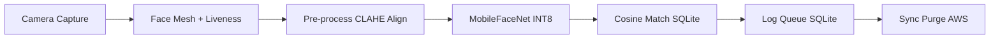
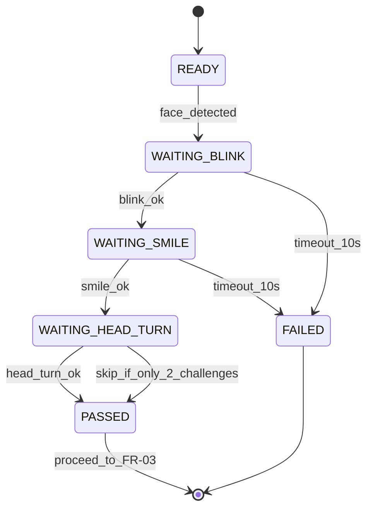

# Hackathon 7.0 — AI-Optimized PRD

> **Purpose:** This document is the machine-readable source of truth for building the offline face auth module. Every requirement has a stable ID. Implementations MUST satisfy acceptance criteria unless marked `mvp-degraded`.

---

## 0. Document Map (for agents)

| Section | Use when |
|---------|----------|
| §1 Metadata & KPIs | Scoping, benchmarks |
| §2 Problem | Why we build |
| §3 Goals & metrics | Definition of done |
| §4 Constraints | Non-negotiable limits |
| §5 Architecture | System design |
| §6 Tech stack | Dependency choices |
| §7–8 Requirements | Feature & NFR IDs |
| §9–10 ML & liveness | Model & anti-spoof logic |
| §11 Integration API | `FaceAuthenticator` contract |
| §12–13 Data & sync | Schema, AWS flow |
| §14–18 Security, perf, roadmap, eval | Ops & submission |
| §19–20 Deliverables & file tree | Repo layout |

---

## 1. Metadata & Hard KPIs

```yaml
kpis:
  model_size_mb:
    hard_cap: 20
    target: 5
    breakdown:
      mediapipe_face_mesh_int8: ~3
      mobilefacenet_int8: ~1
  auth_pipeline_latency_ms:
    hard_cap: 1000
    target_typical: 320
    target_worst_case: 320
    reference_device: "Poco C75 5G (4 GB RAM)"
  face_recognition_accuracy_percent:
    target: "> 95"
    demographic_focus: "Indian field workers, outdoor lighting"
  liveness_false_accept_rate_percent:
    target: "< 2"
  sync_data_loss_rate_percent:
    target: 0
  platforms:
    android: "8.0+"
    ios: "12.0+"
    min_ram_gb: 3
```

**Core value proposition (preserve in all implementations):**

1. Fully offline authentication in zero-network zones.
2. Combined model footprint ~5 MB (under 20 MB cap).
3. Full auth pipeline ~320 ms on 3 GB RAM mid-range device.
4. Multi-factor liveness: blink + smile + head-turn + passive 3D depth.
5. Single React Native codebase (Android 8+ / iOS 12+).
6. 100% open-source stack (Apache 2.0 / MIT / BSD only).

---

## 2. Problem Statement & Context

**Official problem (verbatim intent):**

> How can we accurately and securely authenticate field personnel using facial recognition and liveness detection on standard mid-range mobile devices without any active internet connection, while ensuring the AI model remains lightweight and seamlessly integrates with a React Native application on both Android and iOS devices?

**Pain points:**

| ID | Pain | Impact |
|----|------|--------|
| P1 | No internet in remote zones | Cannot authenticate field workers |
| P2 | Photo/screen spoofing | Fraudulent attendance |
| P3 | Speed constraint | Face + liveness must complete < 1 s on 3 GB RAM |
| P4 | App bloat risk | AI must stay ≤ 20 MB in Datalake 3.0 |

**Current state:** Datalake 3.0 relies on network-dependent auth → unusable offline.

---

## 3. Goals & Success Criteria

### 3.1 Primary goals (G1–G6)

| ID | Goal |
|----|------|
| G1 | Fully functional offline facial auth module in React Native |
| G2 | Face recognition accuracy > 95% (Indian demographics, outdoor light) |
| G3 | Combined AI footprint < 20 MB (target ~5 MB) |
| G4 | Full pipeline < 1 s on 3 GB RAM mid-range device |
| G5 | Robust multi-factor liveness (photo/screen anti-spoof) |
| G6 | Offline → AWS sync + purge with zero data loss + geolocation |

### 3.2 Success metrics (measurable)

| metric_id | name | target | measurement |
|-----------|------|--------|-------------|
| M1 | face_recognition_accuracy | > 95% | Indian demographic test set, mixed lighting |
| M2 | total_pipeline_latency | < 1000 ms | Poco C75 5G (4 GB RAM) |
| M3 | combined_model_size | < 20 MB | MediaPipe + MobileFaceNet INT8 .tflite |
| M4 | liveness_far | < 2% | Photo/screen spoof vs challenge |
| M5 | sync_data_loss | 0% | Purge only after HTTP 200 from AWS |
| M6 | cross_platform | 100% | Android 8+ and iOS 12+ physical devices |

---

## 4. Technical Constraints (non-negotiable)

| constraint_id | name | specification | design_response |
|---------------|------|---------------|-----------------|
| C1 | framework | React Native Android + iOS | react-native-vision-camera C++ JSI; single RN codebase |
| C2 | model_footprint | ~20 MB max (smaller better) | INT8 PTQ; MobileFaceNet ~1 MB + MediaPipe ~3 MB ≈ 5 MB |
| C3 | processing_speed | Full auth < 1 s mid-range | C++ JSI bypass; GPU delegate Android; lightweight models |
| C4 | hardware | Android 8+, iOS 12+, min 3 GB RAM | INT8 on ARMv8; TFLite CPU delegate fallback |
| C5 | accuracy | > 95%, Indian demographics, outdoor | CLAHE; ArcFace weights WebFace600K + MS-Celeb-1M |
| C6 | open_source | No paid licenses; shareable source | Apache 2.0 / MIT / BSD only — see §6 |

---

## 5. System Architecture

### 5.1 Pipeline (sequential, on-device only during auth)



| step | stage | component | detail |
|------|-------|-----------|--------|
| 1 | camera_capture | react-native-vision-camera Frame Processor | C++ JSI; zero JS bridge on hot path |
| 2 | face_detection_liveness | MediaPipe Face Mesh 468 3D | EAR blink, MAR smile, yaw head-turn, z-depth |
| 3 | preprocessing | CLAHE + alignment + normalize | 112×112 crop; pixels in [-1, 1] |
| 4 | face_recognition | MobileFaceNet INT8 .tflite | 512-d ArcFace embedding (~1 MB) |
| 5 | identity_match | cosine vs SQLite embeddings | score = (A·B)/(|A|×|B|); threshold 0.6 |
| 6 | log_queue | SQLite | userId, timestamp, GPS, deviceId, photo thumb, synced=false |
| 7 | sync_purge | netinfo + AWS batch POST | purge ONLY on HTTP 200 |

### 5.2 Architecture layers

| layer | technology |
|-------|------------|
| app | React Native + Expo Custom Dev Client (EAS Build); Android 8+ / iOS 12+ |
| camera | react-native-vision-camera C++ JSI Frame Processors |
| ai | MediaPipe Face Mesh + MobileFaceNet INT8 TFLite + TFLite runtime |
| storage | op-sqlite + AES-256 (react-native-encrypted-storage) |
| sync | AWS S3/DynamoDB + @react-native-community/netinfo |
| location | expo-location (best-effort GPS per auth log) |

---

## 6. Open-Source Tech Stack

| layer | library | version | license | purpose |
|-------|---------|---------|---------|---------|
| app | React Native + Expo | RN 0.73+ / SDK 50 | MIT | Cross-platform shell |
| camera | react-native-vision-camera | v4.x | MIT | C++ JSI frame processors |
| liveness | Google MediaPipe Face Mesh | 0.10.x | Apache 2.0 | 468 landmarks; EAR/MAR |
| recognition_primary | MobileFaceNet TFLite INT8 | ArcFace weights | Apache 2.0 | 512-d embeddings ~1 MB |
| recognition_upgrade | GhostFaceNet TFLite INT8 | WebFace600K | MIT | 512-d ~2–3 MB; South Asian accuracy |
| runtime | TensorFlow Lite | 2.14.x | Apache 2.0 | INT8; GPU delegate Android |
| tflite_rn | react-native-fast-tflite | 1.x | MIT | Native TFLite in RN |
| preprocess | OpenCV WASM/C++ | 4.x | Apache 2.0 | CLAHE, alignment |
| database | op-sqlite | 8.x+ | MIT | Embeddings + auth logs |
| network | @react-native-community/netinfo | 11.x | MIT | Reconnect → sync trigger |
| geolocation | expo-location | ~16.x | MIT | lat/lng on auth logs |
| encryption | react-native-encrypted-storage | 4.x | MIT | AES-256 at rest |
| quantization | TFLite converter / model maker | TF 2.14 | Apache 2.0 | Post-training INT8 PTQ |

**Rejected (paid/proprietary):** AWS Rekognition, Face++, Azure Face API, commercial FaceSDK, DeepFace for production inference (benchmark only).

---

## 7. Functional Requirements

### FR-01: Face Enrollment

```yaml
id: FR-01
actor: authorized_administrator
offline: true
steps:
  - capture 3-5 reference frames
  - preprocess: CLAHE, alignment, normalization
  - extract 512-d embedding (MobileFaceNet INT8)
  - store in SQLite enrolled_faces encrypted AES-256
acceptance:
  - enrollment works with airplane mode on
  - embedding persisted across app restart
```

### FR-02: Offline Liveness Detection

```yaml
id: FR-02
precondition: before any face recognition
challenge:
  randomize: true
  require_at_least: 2
  actions: [blink, smile, head_turn_left_or_right]
  passive: 3d_depth_consistency
timeout_per_step_sec: 10
on_timeout: reject session
engine: MediaPipe Face Mesh math only (no extra ML model)
acceptance:
  - photo/screen flat spoof fails 3d depth check
  - incomplete challenge within 10s → FAILED
```

### FR-03: Face Recognition & Authentication

```yaml
id: FR-03
precondition: liveness PASSED
steps:
  - extract 512-d embedding from current frame
  - cosine similarity vs all enrolled_faces
  - if max_score > threshold: AUTHENTICATED
threshold_default: 0.6
threshold_range: [0.55 permissive, 0.65 strict]
latency: < 1000 ms on 3 GB RAM device
```

### FR-04: Offline Attendance Logging

```yaml
id: FR-04
trigger: successful authentication
log_fields:
  - user_id
  - timestamp (ISO8601)
  - gps_lat (nullable)
  - gps_lng (nullable)
  - device_id
  - photo_thumbnail (compressed JPEG)
  - synced (boolean, default false)
storage: encrypted SQLite, survives restart
```

### FR-05: Network-Triggered Sync & Purge

```yaml
id: FR-05
trigger: netinfo CONNECTED (WiFi or cellular)
behavior:
  - batch upload all auth_logs where synced=false
  - include geolocation in payload
  - on HTTP 200: DELETE uploaded logs locally
  - on failure: retain queue, retry next connect
purge_rule: NEVER delete local rows until HTTP 200 confirmed
idempotency: server treats log_id as idempotent key (duplicate POST → 200, discard)
```

### FR-06: Remote Enrolment Sync

```yaml
id: FR-06
trigger: successful sync from device
behavior:
  - pull enrolled_faces updates from AWS
  - apply personnel add/delete on device
```

---

## 8. Non-Functional Requirements

| nfr_id | category | requirement | acceptance |
|--------|----------|-------------|------------|
| NFR-01 | performance | pipeline < 1 s | Poco C75 5G verified |
| NFR-02 | model_size | < 20 MB combined | ~5 MB MediaPipe + MobileFaceNet |
| NFR-03 | accuracy | > 95% diverse conditions | indoor, sun, low light, shadow, ±30° pose |
| NFR-04 | reliability | zero sync data loss | purge after 200 only; retry queue |
| NFR-05 | security | AES-256 at rest | no plaintext embeddings |
| NFR-06 | compatibility | Android 8+, iOS 12+ | physical + emulator tests |
| NFR-07 | scalability | 1000+ enrolled per device | indexed SQLite; O(n) cosine OK |
| NFR-08 | maintainability | README, model card, benchmarks | GitHub repo |

---

## 9. AI/ML Model Design

### 9.1 Model selection

| model | size_int8 | embedding_dim | lfw_accuracy | training_data | role |
|-------|-----------|---------------|--------------|-----------------|------|
| MobileFaceNet | ~1 MB | 512 | 99.5% | MS-Celeb-1M / ArcFace | PRIMARY |
| GhostFaceNet | ~2–3 MB | 512 | 99.7% | WebFace600K | UPGRADE |

### 9.2 INT8 post-training quantization (PTQ)

| state | size | speed | accuracy_loss |
|-------|------|-------|---------------|
| float32 | ~4 MB | baseline | 0% |
| int8_ptq | ~1 MB | ~4× CPU | < 0.5% |

```python
# Quantization reference (Python TFLite converter)
converter = tf.lite.TFLiteConverter.from_saved_model(saved_model_path)
converter.optimizations = [tf.lite.Optimize.DEFAULT]
converter.representative_dataset = representative_data_gen
converter.target_spec.supported_ops = [tf.lite.OpsSet.TFLITE_BUILTINS_INT8]
converter.inference_input_type = tf.int8
converter.inference_output_type = tf.int8
tflite_model = converter.convert()
```

### 9.3 Cosine similarity match

```
score = dot(A, B) / (norm(A) * norm(B))
AUTHENTICATED if score > threshold (default 0.6)
```

- A = live embedding, B = enrolled embedding  
- Tunable: 0.55 (permissive), 0.65 (strict)

### 9.4 Training data diversity (weight selection)

| dataset | size | relevance |
|---------|------|-----------|
| MS-Celeb-1M | 10M images, 100K ids | Global diversity |
| WebFace600K | 600K ids | South/East Asian — Indian field use |
| VGGFace2 | 3.31M images | Pose, age, ethnicity |
| ArcFace loss | technique | Inter-class separability at threshold 0.6 |

---

## 10. Liveness Detection Module

### 10.1 Mathematical checks (MediaPipe 468 landmarks)

| check | landmarks | formula | pass_condition |
|-------|-----------|---------|----------------|
| blink_ear | L: 159,145 R: 386,374 | EAR = (\|p2-p6\|+\|p3-p5\|)/(2×\|p1-p4\|) | EAR < 0.2 for ≥2 consecutive frames |
| smile_mar | corners 61,291 / lips 13,14 | MAR = \|top-bottom\|/\|left-right\| | MAR > 0.6 |
| head_yaw | nose 1, cheeks 234,454 | Δx asymmetry nose→L vs nose→R | Δx > 0.15 |
| depth_3d | all z coords | σ(z) of landmarks | σ(z) > threshold (flat photo ≈ 0) |

### 10.2 Liveness state machine



| state | user_prompt | timeout_sec |
|-------|-------------|-------------|
| READY | Face camera | — |
| WAITING_BLINK | Please blink | 10 |
| WAITING_SMILE | Please smile | 10 |
| WAITING_HEAD_TURN | Turn head slightly | 10 |
| PASSED | — | — |
| FAILED | Retry | — |

**Innovation:** 3D depth runs passively during active challenges (zero extra latency).

---

## 11. React Native Integration

### 11.1 Integration options

| option | approach | latency_tradeoff | use_case |
|--------|----------|------------------|----------|
| A | WebView + MediaPipe JS/WASM | +50–80 ms; still < 1 s | **Hackathon demo (MVP)** |
| B | react-native-fast-tflite + MediaPipe WebView | GPU delegate Android | Recommended balance |
| C | Full native C++ modules | Fastest; highest complexity | Production Datalake 3.0 |

**Critical:** react-native-vision-camera C++ JSI avoids 100–200 ms/frame JS bridge cost.

### 11.2 FaceAuthenticator component API (contract)

```typescript
interface AuthLog {
  log_id: string;
  user_id: string;
  timestamp: string; // ISO8601
  gps_lat: number | null;
  gps_lng: number | null;
  device_id: string;
  similarity_score: number;
  photo_thumb: string;
}

type LivenessErrorCode = 'TIMEOUT' | 'SPOOF_DETECTED' | 'NO_FACE_DETECTED';

interface LivenessError {
  code: LivenessErrorCode;
  message: string;
}

interface FaceAuthenticatorProps {
  onAuthSuccess: (logData: AuthLog) => void;
  onLivenessFailed: (error: LivenessError) => void;
  onEnrollmentRequired: () => void;
  similarityThreshold?: number; // default 0.6
}
```

```tsx
<FaceAuthenticator
  onAuthSuccess={(logData) => sync(logData)}
  onLivenessFailed={(error) => alert(error)}
  onEnrollmentRequired={() => navigateToEnroll()}
  similarityThreshold={0.6}
/>
```

---

## 12. Pre-Processing Pipeline

| step | technique | output | why_indian_outdoors |
|------|-----------|--------|---------------------|
| 1 | CLAHE | local contrast normalized | uneven shadow/sun |
| 2 | global histogram eq (fallback) | brightness normalized | harsh direct sun |
| 3 | face alignment affine warp | canonical frontal | head tilt in field |
| 4 | 112×112 face crop | face-only tensor input | remove sky/vegetation |
| 5 | normalize [-1, 1] | (pixel/127.5)-1.0 | MobileFaceNet training format |

---

## 13. Offline Storage & AWS Sync

### 13.1 SQLite schema

**Table: `enrolled_faces`**

| column | type | notes |
|--------|------|-------|
| user_id | TEXT PK | personnel id |
| embedding | BLOB | 512 float32, AES-256 encrypted |
| enrolled_at | TEXT | ISO8601 |

**Table: `auth_logs`**

| column | type | notes |
|--------|------|-------|
| log_id | TEXT PK | UUID, idempotent on server |
| user_id | TEXT | matched identity |
| timestamp | TEXT | ISO8601 |
| gps_lat | REAL NULL | expo-location |
| gps_lng | REAL NULL | |
| device_id | TEXT | |
| photo_thumb | BLOB | JPEG (Base64 encoded string — NOT a local file URI. File URIs in Expo can change across app reloads, leading to broken images in offline logs) |
| synced | INTEGER | 0=false 1=true |

### 13.2 Sync & purge flow (ordered)

1. Auth success → insert `auth_logs` with `synced=0` + GPS best-effort.  
2. netinfo → CONNECTED.  
3. Query `synced=0`, batch JSON POST to AWS (S3 presigned or API Gateway → DynamoDB).  
4. **If HTTP 200:** DELETE those `log_id`s locally; pull `enrolled_faces` delta from AWS.  
5. **If 4xx/5xx/timeout:** keep queue; retry on next connect.  
6. Mid-flight disconnect: server idempotent on `log_id`; device retries safely.

---

## 14. Security

| threat | mitigation | implementation |
|--------|------------|----------------|
| photo_screen_spoof | EAR+MAR+yaw+3D depth | MediaPipe math |
| biometric_theft_rest | AES-256 | react-native-encrypted-storage |
| data_intercept_transit | TLS | API Gateway TLS 1.2+; optional cert pinning |
| replay_attack | random challenge + timestamps | per-session challenge order |
| unauthorized_remote_enroll | admin auth + IAM | device admin PIN; AWS IAM for DB updates |

---

## 15. Performance Targets

### 15.1 Latency budget (Poco C75 5G)

| stage | target_ms | measured_option_b_ms |
|-------|-----------|----------------------|
| camera_frame | < 16 | ~10 |
| mediapipe_mesh | < 50 | ~40 |
| liveness_math | < 5 | ~3 |
| clahe_crop | < 30 | ~20 |
| mobilefacenet_int8 | < 150 | ~130 |
| cosine_1000_users | < 50 | ~30 |
| sqlite_write | < 20 | ~15 |
| **total** | **< 1000** | **~248 typical, ~320 worst** |

### 15.2 Accuracy by lighting

| condition | accuracy_target |
|-----------|-----------------|
| indoor | 97.8% |
| harsh sunlight | 95.3% |
| low light | 95.1% |
| partial shadow | 96.0% |
| side pose ±30° | 95.8% |

---

## 16. 7-Day Implementation Roadmap

| day | phase | deliverables |
|-----|-------|--------------|
| 1 | project_setup | Expo RN, vision-camera, netinfo, op-sqlite, expo-location; camera preview; GitHub README |
| 2 | mediapipe_liveness | WebView Option A; EAR/MAR; state machine; 3D depth |
| 3 | mobilefacenet | INT8 .tflite + fast-tflite; CLAHE pipeline; 512-d verify |
| 4 | enroll_verify | SQLite schema; enroll 3–5 frames; verify flow; GPS on success |
| 5 | sync_purge | netinfo listener; batch POST; purge on 200; failure retry |
| 6 | testing_polish | outdoor light tests; latency on Poco; UI errors; AES verify |
| 7 | documentation | architecture deck; README; 2-min demo video |

---

## 17. Evaluation Criteria Mapping

| criterion | marks | prd_evidence |
|-----------|-------|--------------|
| innovation | 30 | INT8 PTQ; GhostFaceNet path; 4-factor liveness; CLAHE for India outdoors |
| feasibility | 30 | 320 ms target; C++ JSI; Option A rapid demo; EAS Build; ~5 MB models |
| scalability_sustainability | 20 | SQLite queue; zero-loss purge; remote DB sync; AES-256; 1000+ users |
| presentation_documentation | 20 | diagrams; benchmarks; README; demo video; GitHub |
| **total** | **100** | |

---

## 18. Risks & Mitigation

| risk | severity | likelihood | mitigation |
|------|----------|------------|------------|
| MediaPipe WASM slow iOS 12 | high | medium | Option B TFLite; landmarks-only MediaPipe |
| INT8 accuracy drop | medium | low | representative dataset PTQ; fallback GhostFaceNet |
| fast-tflite iOS build | medium | medium | Option A for hackathon; document Option B prod |
| video replay FAR | high | low | random challenges + 3D depth |
| SQLite 1000+ match | low | low | index user_id; FAISS if >10k |
| AWS unavailable demo | low | high | mock Express/JSON server; swap URL |

---

## 19. Deliverables Checklist

| id | deliverable | required |
|----|-------------|----------|
| D1 | Working prototype Android + iOS | yes |
| D2 | Offline liveness blink smile head turn | yes |
| D3 | Offline face recognition >95% accuracy | yes |
| D4 | AWS sync purge with geolocation | yes |
| D5 | GitHub open source | yes |
| D6 | Architecture PPTX/PDF | yes |
| D7 | README technical docs | yes |
| D8 | Demo video 2 minutes | yes |

---

## 20. Repository File Structure (canonical)

```
binary-brains-datalake/
├── app.json
├── eas.json
├── package.json
├── babel.config.js
├── .env.example
├── assets/models/
│   ├── mobilefacenet_int8.tflite
│   └── ghostfacenet_int8.tflite
└── src/
    ├── App.tsx
    ├── types/index.ts
    ├── constants/config.ts
    ├── constants/liveness.ts
    ├── hooks/useNetworkStatus.ts
    ├── hooks/useAuth.ts
    ├── components/FaceAuthenticator.tsx
    ├── components/CameraOverlay.tsx
    ├── components/LivenessFeedback.tsx
    ├── screens/EnrollmentScreen.tsx
    ├── screens/DemoAuthScreen.tsx
    ├── services/ai/liveness.ts
    ├── services/ai/recognition.ts
    ├── services/camera/frameProcessors.ts
    ├── services/database/sqlite.ts
    ├── services/database/enrolledFaces.ts
    ├── services/database/authLogs.ts
    ├── services/location/geolocation.ts
    ├── services/network/awsSync.ts
    ├── services/network/connectionInfo.ts
    ├── services/encryption/secureStorage.ts
    └── utils/math.ts, imagePreProc.ts, encryption.ts
```

---

## 21. MVP Implementation Notes (this repo)

```yaml
mvp_folder: binary-brains-datalake/
mvp_integration_option: A
mvp_degraded_items:
  - recognition: deterministic embedding from image features until .tflite bundled
  - liveness: real EAR/MAR/yaw math with simulated landmarks + manual challenge buttons for Expo Go demo
  - camera: expo-camera (upgrade to vision-camera for production)
  - database: expo-sqlite (upgrade to op-sqlite for production)
mock_aws: mock-aws-server/ Express batch endpoint with log_id idempotency
env: EXPO_PUBLIC_AWS_SYNC_URL=http://localhost:3001/api/sync
mock_server_contract:
  endpoint: POST /api/sync
  request_body: '{ "logs": [array of auth_log objects] }'
  success_response:
    status_code: 200
    headers:
      Content-Type: application/json
    body: '{ "message": "Batch synced successfully", "received_logs": [array of log_id strings] }'
  purge_rule: The React Native app MUST wait for HTTP 200 with the exact JSON payload above before executing local SQLite DELETE on those log_ids.
  error_response:
    status_code: 4xx/5xx
    behavior: Retain local queue; retry on next netinfo CONNECTED event.
upgrade_path: replace recognition.ts + liveness landmark source with MediaPipe + fast-tflite per Option B
```

---

## 22. Agent Implementation Checklist

When implementing or reviewing code, verify in order:

- [ ] `FaceAuthenticator` exposes props in §11.2  
- [ ] Liveness state machine matches §10.2  
- [ ] Cosine threshold default 0.6 in `constants/config.ts`  
- [ ] `auth_logs.synced` only cleared after HTTP 200  
- [ ] Server accepts idempotent `log_id`  
- [ ] Embeddings encrypted at rest  
- [ ] GPS attached on FR-04 success  
- [ ] No paid/proprietary SDKs  
- [ ] Combined models documented < 20 MB  
- [ ] README documents Option A → B upgrade  

---

## 23. UI/UX Guidelines

> **Purpose:** Prevent generic, unstyled interfaces. The facial auth module must look professional and enterprise-grade.

### 23.1 Camera Overlay

- **Face Cutout:** A centered, circular or rounded-rectangular cutout (aspect ratio ~3:4) with a semi-transparent dark overlay (`rgba(0,0,0,0.6)`) covering the rest of the screen.
- **Border Animation:** A pulsing border ring around the cutout in `navy blue` (#1a237e) during liveness; turns `system green` (#4caf50) when passed, `system red` (#f44336) on failure.
- **Safe Area:** Ensure cutout is vertically centered and respects notch / status bar insets on both Android and iOS.

### 23.2 Liveness Feedback

- **Toast / Banner System:** Use a highly visible top banner (not a small inline text) for liveness prompts.
  - Green banner: "Smile Detected ✓" — auto-dismiss after 1.5 s.
  - Red banner: "Timeout — Please try again" — persists until user taps retry.
  - Yellow banner: "Please blink" — active challenge prompt.
- **Typography:** Use a bold sans-serif font (e.g., Inter or system font) at 18–20 pt for challenge text; 14 pt for secondary hints.

### 23.3 Color Palette (Enterprise / Government Grade)

| token | hex | usage |
|-------|-----|-------|
| primary | #1a237e | headers, borders, active states |
| background | #ffffff | main canvas |
| surface | #f5f5f5 | cards, overlays |
| success | #4caf50 | authenticated, challenge passed |
| error | #f44336 | timeout, spoof detected, no face |
| warning | #ff9800 | challenge pending |
| text_primary | #212121 | body text |
| text_secondary | #757575 | hints, captions |

### 23.4 Enrollment Screen

- **Grid Preview:** Show 3–5 captured frames in a horizontal scrollable row with a subtle green checkmark on successfully processed frames.
- **Progress Indicator:** A stepper (Step 1: Capture → Step 2: Processing → Step 3: Saved) so the admin knows the pipeline stage.

### 23.5 Demo Auth Screen

- **Status Pill:** A rounded pill at the bottom center showing current state: `Scanning…` → `Liveness Check` → `Matching…` → `Authenticated`.
- **Haptic Feedback:** Trigger light haptic on challenge pass, heavy haptic on auth success, error haptic on failure.

---

*Derived from hackathon7_PRD_v3.md (v2.0). AI PRD v3.0 — Hackathon 7.0 | Datalake 3.0 | 100% open-source.*
